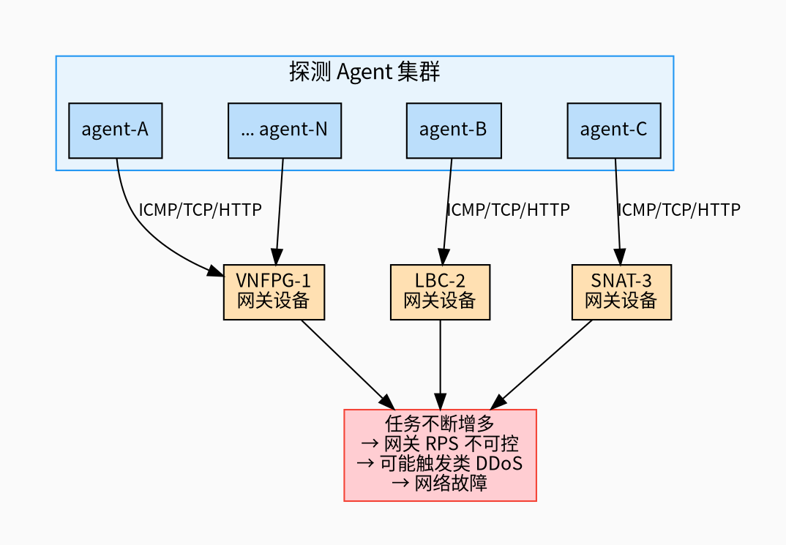
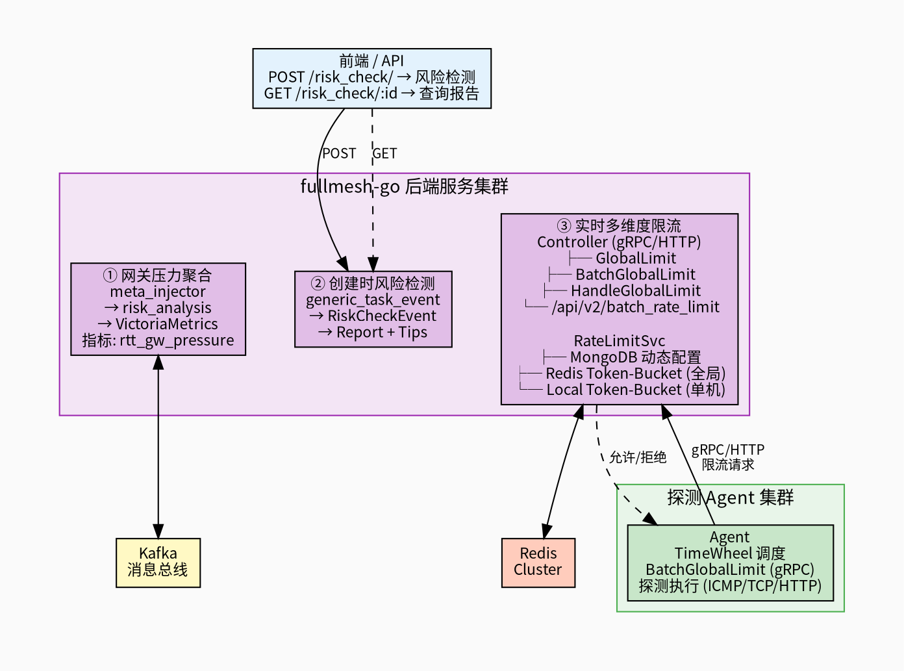
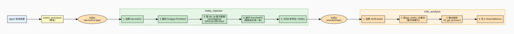
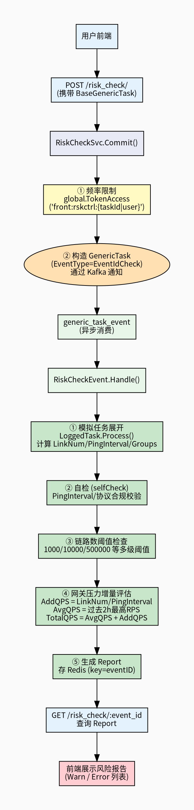
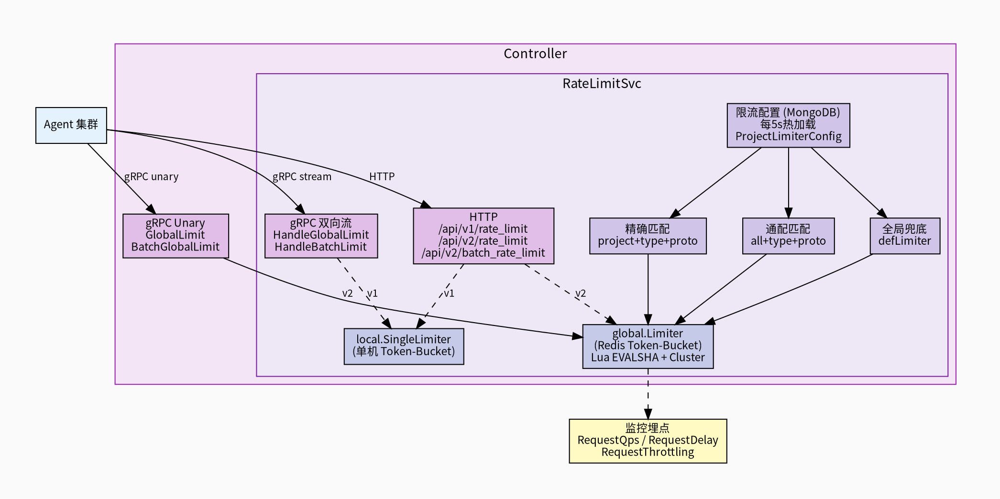
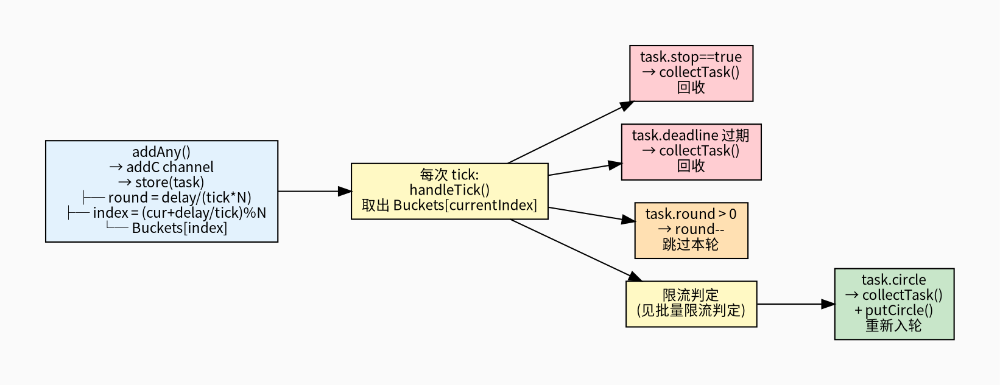
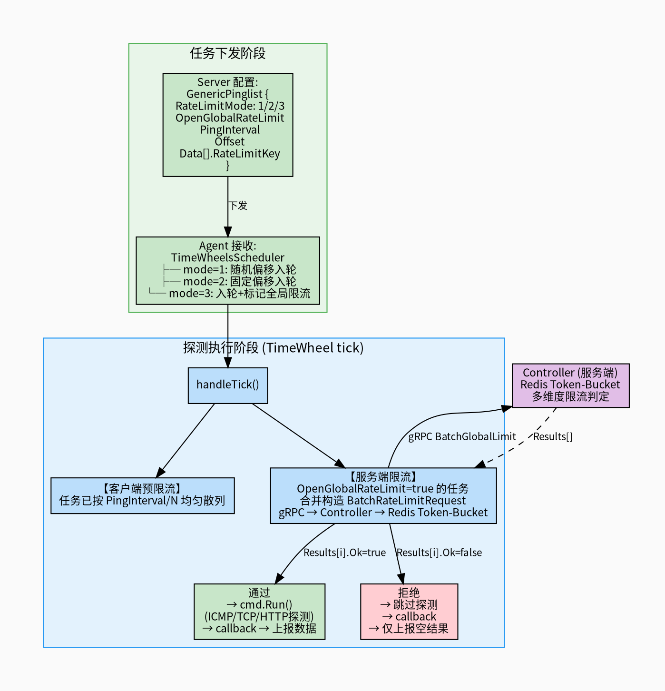
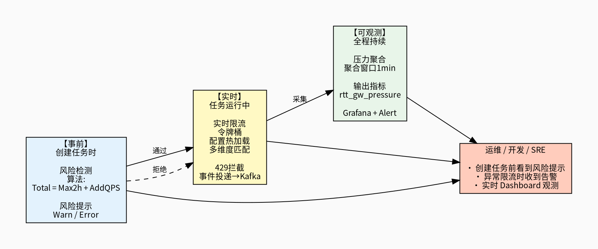
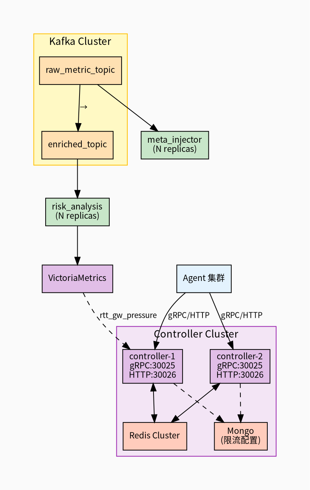

# 网关探测限流防护体系 — 技术分享

> **项目**：fullmesh-go 主动探测平台  
> **日期**：2026-03  
> **作者**：网络监控团队

---

## 一、背景与问题

主动探测告警在保障互娱游戏网络质量方面发挥了重要作用。随着探测任务持续增长，探测流量对网关（DNAT/SNAT/LBC/VNFPG 等）构成的压力越来越大。借鉴以往自建探测插件导致 DDoS、给网关造成不可预测故障的教训，我们需要从**可观测性、事前评估、实时拦截**三个维度构建防护体系。

### 核心风险



**三大应对措施**：

| 层次 | 措施 | 目标 |
|------|------|------|
| **可观测** | 实时网关压力聚合分析 | 观测各网关探测 RPS，配合告警第一时间感知风险 |
| **事前** | 增量探测创建时风险检测 | 预估新任务对网关的压力增量，给出风险提示 |
| **实时** | 多维度可配置实时限流 | 拦截突发或不可预测因素导致的探测压力陡增 |

---

## 二、整体架构

本防护体系由**服务端**（fullmesh-go 后端集群）与**Agent 端**共同构成，二者通过 gRPC/HTTP 协同完成实时限流判定。



---

## 三、模块一：实时网关压力聚合分析

### 3.1 目标

实时统计每个网关实体（VNFPG、LBC、Node、Host）每分钟被探测的请求数（RPS），输出为时序指标写入 VictoriaMetrics，配合 Grafana + 告警规则，第一时间感知网关压力异常。

### 3.2 数据流



### 3.3 关键设计

#### meta_injector：元数据注入

- **输入**：原始探测 metric 流（Snappy+Protobuf 编码的 `prompb.WriteRequest`）
- **元数据查询**：通过 `autotagging.TaggingService` 按 `dst_ip` 查询网关元信息
  - EIP → 提取 `vnfpg[0].uuid / type`
  - LBC → 提取 `uuid / name`
  - Host → 提取 `hostname`
- **缓存策略**：内存 `map[ip]cachedGWMeta`，TTL 5 分钟，上限 10 万条，超限后 LRU 淘汰
- **输出**：`EnrichedMetricBatch` JSON → Kafka enriched topic

```go
type EnrichedMetricTS struct {
    TaskID, Project, SrcIP, DstIP, Metric string
    TsMs         int64
    Value        float64
    EntityType   string  // vnfpg / lbc / node / host
    EntityID     string
    EntityName   string
    MetaProject  string
    PingInterval int64
    Labels       map[string]string
}
```

#### risk_analysis（GWRPSValueHandler）：网关压力聚合

- **聚合引擎**：`AggrProcessor` + Event-Time Windowing
  - 按 `gw_entity_id` 分桶（hash buckets）
  - 每分钟一个窗口，窗口内对 count 累加
  - 支持乱序容忍（`AllowedLatenessSec`）和补偿刷新（`LateCompensate`）
- **聚合 Key**：`labels.GwEntityID`（即 vnfpg uuid / lbc uuid / node hostname / host IP）
- **输出指标**：

| 指标名 | Labels | 含义 |
|--------|--------|------|
| `rtt_gw_pressure` | `entity_type`, `entity_id`, `entity_name`, `project`, `env`, `version` | 该网关实体每分钟被探测次数 |

- **异步 Sink**：通过带缓冲 channel（10000）+ 后台 worker 批量推送 VictoriaMetrics，避免聚合主路径被写入阻塞

### 3.4 告警配置（示例）

```yaml
# Grafana/Prometheus alerting rule
- alert: GW_RPS_High
  expr: rtt_gw_pressure{entity_type="vnfpg"} > 5000
  for: 2m
  labels:
    severity: warning
  annotations:
    summary: "网关 {{ $labels.entity_name }} 探测 RPS 超过 5000"
```

---

## 四、模块二：增量探测创建时风险检测

### 4.1 目标

用户创建/修改探测任务时，**在任务实际生效前**估算该任务对网关的影响，给出风险报告（Warn/Error）。

### 4.2 流程图



### 4.3 Report 数据结构

```go
type Report struct {
    Dst, Src        Side
    IntervalDataNum int64
    LinkNum         int64
    Groups          map[string]struct{}
    PingInterval    int64
    TaskID          int64
    TaskName        string
    Tips            Tip    // { Warn: [], Error: [] }
}

type GwPressureItem struct {
    EntityType string   // vnfpg / lbc
    EntityID   string
    AddQPS     float64  // 新增任务产生的 RPS = LinkNum / PingInterval
    AvgQPS     float64  // 过去 2h 最高 RPS（由模块一的聚合所得）
    TotalQPS   float64  // AvgQPS + AddQPS
}
```

---

## 五、模块三：多维度可配置实时限流

本模块涵盖**服务端限流能力建设**与 **Agent 端协同接入**两部分，二者共同构成端到端的实时限流体系。

### 5.1 目标

对于突发或不可预测因素导致的探测压力陡增，通过多维度（按项目/按协议/按目标类型/全局）的实时限流机制进行拦截。Agent 在每次探测执行前向服务端发起限流预检，由服务端 Redis Token-Bucket 统一判定。

### 5.2 架构总览



### 5.3 限流配置模型

配置存储在 MongoDB，由 `RateLimitSvc` 每 5 秒热加载，**支持动态增删改**（删除配置后对应 limiter 自动移除）。

```go
type ProjectLimiterConfig struct {
    Project     string  // 项目名，"all" 表示通配
    TargetType  string  // dst / src / 目标类型
    ProjectType string  // task / src / dst
    Protocol    string  // tcp / icmp / http / "all" 通配
    Limit       int     // 令牌桶速率 (tokens/sec)
    Burst       int     // 令牌桶容量
}
```

**多级匹配逻辑**（优先级从高到低）：

```
1. project + projectType + targetType + protocol  → 精确匹配
2. "all"   + projectType + targetType + protocol  → 项目通配
3. "all"   + projectType + targetType + "all"     → 项目+协议通配
4. defLimiter                                     → 全局兜底
```

### 5.4 令牌桶实现

#### 单机版（local.SingleLimiter）

- 基于 `golang.org/x/time/rate.Limiter`
- 每个 target IP 独立桶（`map[string]*visitor`）
- 后台 goroutine 定期清理过期 visitor
- 适用于 v1 API（流式 gRPC handler）

#### Redis 集群版（global.Limiter）

- 原子 Lua 脚本实现 Token-Bucket，保证多实例一致性
- 支持 Redis Cluster（Hash Tag `{key}` 保证同 slot）
- EVALSHA 优先 + NOSCRIPT 自动 fallback
- 支持配置 rate/burst/cost/TTL
- 适用于 v2 API 和 Unary gRPC

```lua
-- 核心 Lua 逻辑（简化）
local tokens = redis.call("HGET", key, "tokens") or burst
local delta  = (now_ms - last_ts) / 1000 * rate
tokens = min(burst, tokens + delta)

if tokens >= cost then
    tokens = tokens - cost
    return {1, tokens, ...}   -- allowed
else
    return {0, tokens, retry_after_ms, ...}  -- rejected
end
```

### 5.5 接入协议对比

| 接入方式 | 方法 | 后端 Limiter | 适用场景 |
|---------|------|-------------|---------|
| gRPC 双向流 | `HandleGlobalLimit` | local SingleLimiter | 老版 Agent，单连接复用 |
| gRPC 双向流 | `HandleBatchGlobalLimit` | local SingleLimiter | 老版 Agent 批量 |
| gRPC Unary | `GlobalLimit` | Redis global Limiter | 新版 Agent，低延迟 |
| gRPC Unary | `BatchGlobalLimit` | Redis global Limiter | 新版 Agent 批量 |
| HTTP | `/api/v1/rate_limit` | local SingleLimiter | 兼容接入 |
| HTTP | `/api/v2/rate_limit` | Redis global Limiter | 推荐 HTTP 接入 |
| HTTP | `/api/v2/batch_rate_limit` | Redis global Limiter | 推荐 HTTP 批量 |

### 5.6 Proto 定义

```protobuf
service RateLimitUService {
  rpc GlobalLimit(RateLimitRequest)      returns (RateLimitReply);
  rpc BatchGlobalLimit(BatchRateLimitRequest) returns (BatchRateLimitReply);
}

message RateLimitRequest {
  string type = 1;       // global / mtr
  string project = 2;
  string src = 3;
  string target = 4;
  int64  start_time = 5;
  string key = 6;        // "dstType=value;..." 多维度 key
  string protocol = 7;
  string sp = 8;         // src_project
  string dp = 9;         // dst_project
  uint32 taskID = 12;
}
```

### 5.7 监控埋点

三个 Prometheus 指标通过 `apistats.APIStat` 统一采集，由 vmlog 每 10 秒推送 VictoriaMetrics：

| 指标 | 类型 | Labels | 用途 |
|------|------|--------|------|
| `fmsh_self_request_qps` | Counter | instance, host, method, status, code | 请求 QPS，按 status=429 过滤可得限流 QPS |
| `fmsh_self_request_delay` | Histogram | instance, host, method, status, code | 请求延迟分布 |
| `fmsh_self_request_throttling` | Counter | instance, host, method, project | 限流计数（按项目维度统计被拦截数） |

> **注意**：`RequestThrottling` 必须在 `registry.MustRegister()` 中注册，否则 vmlog 不会采集。

---

### 5.8 Agent 端接入机制

Agent 通过 gRPC Unary `BatchGlobalLimit` 与服务端限流体系协同，在每次探测执行前完成实时限流判定。

#### 5.8.1 TimeWheel 时间轮调度引擎

Agent 端的任务调度核心是一个自研的 **分层时间轮**（`TimeWheel`），负责管理所有探测任务的定时触发。

##### 核心结构

```go
type TimeWheel struct {
    tick          time.Duration       // 时钟精度（通常 1s）
    ticker        *time.Ticker
    tickQueue     chan time.Time       // TickSafeMode 下的中转队列

    bucketsNum    int
    Buckets       []map[taskID]*Task   // 环形桶数组，每个桶存放到期任务
    bucketIndexes map[taskID]int       // taskID → 所在桶的索引

    currentIndex  int                  // 当前时钟指针

    addC    chan *Task                 // 新增任务信号
    removeC chan *Task                 // 删除任务信号
    stopC   chan struct{}              // 停止信号

    gopool  *grpool.Pool              // 异步执行 worker 池
}
```

##### 调度模式

| 模式 | API | 说明 |
|------|-----|------|
| 周期任务 | `AddCron(delay, deadline, callback, cmd)` | 循环执行，每次到期后重新入轮 |
| 延迟单次 | `AfterFunc(delay, deadline, callback, cmd)` | 延迟触发一次后转为周期任务（用于错峰启动） |
| 一次性 | `Add(delay, deadline, callback, cmd)` | 执行一次后回收 |

##### 任务生命周期



##### Worker 池（grpool）

异步任务（`task.async == true`）通过 `grpool` 执行，避免阻塞时间轮主循环：

```go
// 异步投递到 worker 池
tw.gopool.JobQueue <- func(task *Task) func() {
    return func() {
        task.cmd.Run()
        task.callback(task)
    }
}(task)
```

`grpool` 采用经典的 **worker-dispatcher** 模型：
- 固定数量的 worker goroutine（默认 50）
- dispatcher 从 JobQueue 取任务分发给空闲 worker
- JobQueue 带缓冲（默认 10000），防止瞬时任务堆积

#### 5.8.2 批量限流判定（handleTick 核心逻辑）

每次时间轮 tick 触发时，`handleTick` 会对当前桶中的任务进行 **批量限流预检**：

##### 步骤一：收集需要限流的任务

```go
for _, task := range bucket {
    if !task.cmd.GenericPinglist.OpenGlobalRateLimit {
        continue  // 未开启全局限流的任务直接跳过
    }
    subRequests = append(subRequests, &generated.RateLimitRequest{
        Type:      "global",
        Project:   task.cmd.Project,
        Src:       task.cmd.GetDialIP(),
        Target:    task.cmd.GetTarget(),
        StartTime: lib.Now(),
        Key:       task.cmd.GetRateLimitKey(),  // "srcKey,dstKey" 多维度
        Protocol:  task.cmd.Protocol.String(),
        Sp:        task.cmd.SrcSixTuples.Project,
        Dp:        task.cmd.DstSixTuples.Project,
    })
    taskIndex[task] = seq
    seq++
}
```

##### 步骤二：批量 gRPC 调用

```go
if len(subRequests) > 0 {
    ctx, cancel := context.WithTimeout(common.CancelCtx, time.Second*5)
    defer cancel()
    resp, err = client.GetRateLimitUServiceClient().BatchGlobalLimit(ctx, &batchRequest)
    if err != nil || resp == nil || !resp.Ok {
        someFailed = true  // 批量级失败
    }
}
```

**关键设计**：
- 同一个 bucket 中开启限流的任务**合并为一次批量 RPC**，大幅减少网络往返
- 设置 5 秒超时，防止 RPC 延迟拖慢整个时间轮
- 基于 `common.CancelCtx` 派生，Agent 停止时自动取消

##### 步骤三：逐任务判定执行

| 条件 | 行为 |
|------|------|
| `someFailed == true`（批量失败） | 跳过 `cmd.Run()`，仅执行 callback |
| 该任务在 `taskIndex` 中且被拒 | 跳过 `cmd.Run()`，记录限流日志 |
| 该任务未开启限流 | 直接 `cmd.Run()` + callback |
| 通过限流判定 | `cmd.Run()` 执行探测 + callback |

#### 5.8.3 任务调度与限流模式

`TimeWheelsScheduler` 是 Agent 端的任务调度器，将服务端下发的 `GenericPinglist` 转换为 TimeWheel 中的定时任务。

##### 限流模式（RateLimitMode）

服务端下发任务时通过 `RateLimitMode` 字段指定 Agent 端的限流策略：

| 模式 | 值 | 行为 |
|------|---|------|
| `RateLimitModeRand` | 1 | Agent 在 `[0, PingInterval)` 范围内随机偏移，错峰发送 |
| `RateLimitModeDirect` | 2 | 使用服务端指定的固定偏移量 `Offset` |
| `RateLimitModeGlobal` | 3 | 配合 `OpenGlobalRateLimit=true`，走服务端全局限流 |

```go
switch task.RateLimitMode {
case constant.RateLimitModeRand:
    offset = e.rnd.Int63n(int64(time.Duration(task.PingInterval) * time.Second))
case constant.RateLimitModeDirect:
    offset = task.Offset
}
```

##### 任务均匀散列

对于同一批次的 N 个探测目标，Agent 将它们在 `PingInterval` 内均匀分散：

```
散列间隔 s = PingInterval / len(targets)

target[0] → 偏移 offset
target[1] → 偏移 offset + s
target[2] → 偏移 offset + 2s
...
target[N] → 偏移 offset + N*s
```

这种**客户端预散列**机制与服务端限流形成互补——即使不开启全局限流，Agent 自身也会尽量把请求打散。

##### RateLimitKey 多维度路由

每个探测目标携带 `RateLimitKey`（由服务端在配置中注入），格式为 `"srcKey,dstKey"`，其中 key 包含 `dstType=value;...` 等多维度标签。服务端据此匹配到对应的限流桶（project + targetType + protocol 等）。

```go
func (b BaseCommand) GetRateLimitKey() string {
    if b.SrcSixTuples.RateLimitKey == "" && b.DstSixTuples.RateLimitKey == "" {
        return ""
    }
    return b.SrcSixTuples.RateLimitKey + "," + b.DstSixTuples.RateLimitKey
}
```

#### 5.8.4 Agent 端 gRPC 连接管理

Agent 通过 `GetRateLimitUServiceClient()` 获取与 Controller 的 gRPC 连接：

- **复用连接**：限流 RPC 与其他控制面 RPC 共享同一个 gRPC 连接池
- **懒初始化**：首次调用时建连，避免无限流任务时的无效连接
- **异常熔断**：连接不可用时 `someFailed = true`，该 tick 内所有限流任务降级（跳过执行、仅回调）

#### 5.8.5 任务到期与回收

Agent 端通过两级机制保证任务不会无限运行：

| 机制 | 触发条件 | 行为 |
|------|---------|------|
| **Deadline 过期** | `time.Now().Unix() > task.deadline` | handleTick 中直接回收 |
| **执行次数上限** | `task.Times >= ConsPackNum` | callback 中调用 `CancelTask` |
| **手动停止** | `task.stop = true` | 下次 handleTick 时回收 |
| **任务组删除** | `deleteTasks(groupId)` | 遍历组内所有任务逐一取消 |

开启 `syncPool` 模式后，回收的 `Task` 对象通过 `sync.Pool` 复用，减少 GC 压力：

```go
func (tw *TimeWheel) collectTask(task *Task) {
    index := tw.bucketIndexes[task.id]
    delete(tw.bucketIndexes, task.id)
    delete(tw.Buckets[index], task.id)
    if tw.syncPool {
        defaultTaskPool.put(task)  // Reset + 归还 pool
    }
}
```

### 5.9 Agent ↔ Server 协作全景



---

## 六、三层防护联动



---

## 七、关键技术点总结

### 7.1 Event-Time Windowing 聚合引擎

- 支持乱序事件（`AllowedLatenessSec`），watermark 策略可选 `max_event_time` / `avg_event_time(EWMA)`
- 迟到事件补偿模式（`LateCompensate`），已 flush 的窗口允许在 `MaxCompensationSec` 内更新并重发
- 空闲窗口自动驱逐（`EvictIdleSec`），防止内存泄漏
- Hash-Bucket 分片降低锁粒度

### 7.2 Redis Cluster 令牌桶

- 单 key 原子操作（Lua EVALSHA），无需分布式锁
- Hash Tag `{key}` 保证 key 路由到同一 slot
- 自适应 TTL：`2 * (burst/rate)` 秒，自动清理冷 key
- NOSCRIPT 自动降级（EVALSHA → EVAL → reload）

### 7.3 动态配置热加载

- MongoDB 存储限流规则，`updateLimiters()` 每 5s 全量拉取
- **增量对比**：limiter 未变化则复用实例（避免重建开销）
- **删除感知**：重建 map 后原子替换（`RLock` 读旧 + `Lock` 写新），已删除配置的 limiter 自动移除
- 多级匹配（精确 → 项目通配 → 协议通配 → 全局兜底）

### 7.4 压测工具

`modules/ratelimit_client_grpc_unary/` 提供了完整的 gRPC Unary 限流压测 CLI：
- 支持配置并发、QPS、持续时间
- 支持单次/批量两种模式
- 实时统计延迟（P50/P90/P99）、成功率、限流率
- 支持 TLS、gzip 压缩

### 7.5 Agent 端关键设计

| 设计点 | 方案 | 收益 |
|--------|------|------|
| **批量 RPC** | 同一 bucket 的限流请求合并为一次 BatchGlobalLimit | 减少 90%+ 的限流 RPC 次数 |
| **客户端预散列** | 按 PingInterval/N 均匀分散 + 随机偏移 | 从源头降低瞬时 RPS 尖峰 |
| **异步 Worker 池** | grpool dispatcher-worker 模型 | 探测执行不阻塞时间轮 tick |
| **优雅降级** | 批量 RPC 失败时 someFailed → 跳过执行但保持回调 | 限流服务故障不导致 Agent 崩溃 |
| **多维度 Key** | RateLimitKey 携带 src/dst/type 等标签 | 服务端可按任意维度组合限流 |
| **Deadline 兜底** | 任务级 deadline + 执行次数上限 | 即使调度异常，任务也不会永远执行 |
| **对象池复用** | sync.Pool 回收 Task 对象 | 高频创建/销毁场景下降低 GC 开销 |

---

## 八、部署拓扑



---

## 九、FAQ

**Q1: 限流规则修改后多久生效？**  
A: `updateLimiters()` 每 5 秒拉取一次 MongoDB，因此最迟 5 秒生效。

**Q2: Redis 集群版和单机版 limiter 如何选择？**  
A: v1 API 使用单机版（兼容老 Agent），v2 API 和 Unary gRPC 使用 Redis 集群版（多实例全局一致）。

**Q3: 风险检测是同步还是异步？**  
A: 异步。`Commit` 接口返回 `event_id` 后，任务展开和风险评估在 `generic_task_event` 模块异步执行，前端轮询 `QueryResult` 获取报告。

**Q4: 网关压力聚合的延迟是多少？**  
A: meta_injector 实时消费 + risk_analysis 1 分钟窗口 + 10 秒 flush，端到端约 70~80 秒。

**Q5: 如何新增一个限流维度？**  
A: 在 MongoDB `ProjectLimiterConfig` 中新增一条记录，指定 project/projectType/targetType/protocol + limit/burst 即可，无需重启。

**Q6: Agent 端如何处理限流服务不可用的情况？**  
A: `BatchGlobalLimit` 调用失败时设置 `someFailed = true`，该 tick 内所有开启全局限流的任务均跳过执行（仅回调），保证 Agent 自身不崩溃。待下次 tick 正常后恢复探测。

**Q7: 新版 Agent 和老版 Agent 的限流方式有何区别？**  
A: 老版 Agent 使用 gRPC 双向流（`HandleGlobalLimit`）+ 单机本地 Token-Bucket，限流判定仅在单个服务端实例上进行；新版 Agent 使用 gRPC Unary（`BatchGlobalLimit`）+ Redis 集群 Token-Bucket，多服务端实例共享全局限流状态，一致性更好。
